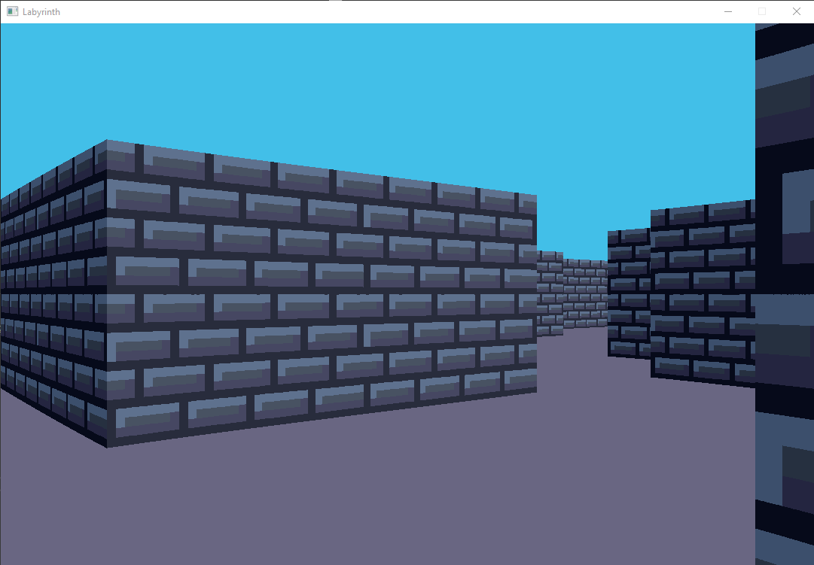
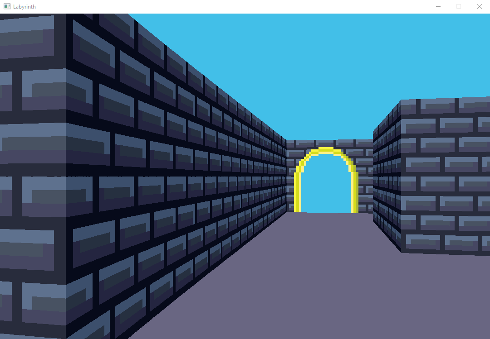

# Labyrinth

A real time Ray Casting procedurally generated labyrinth exploration experience.
Ray Casting: https://en.wikipedia.org/wiki/Ray_casting

## Deployment

This application was built using Visual Studio 2019, and is only configured to run on Windows 10, currently. It was built with the 64-bit version of the SDL2 library, which can be found here: https://www.libsdl.org/download-2.0.php.
It also depends on the glm mathematics library.

I have cloned both dependencies, and they are linked to as submodules.

## Customizations

There are a number of settings that can be made to the application by changing values defined in the `Settings.h` file. The customizable options are:
* `WINDOW_WIDTH` - controls the width of the application window
* `WINDOW_HEIGHT` - controls the height of the application window
* `RESOLUTION` - controls amount of rays cast, resulting in blurrier images the lower the resolution is.
* `RESOLUTION` - the target frame rate.
* `MAP_COLUMNS` - controls the number of columns the randomly generated map will have.
* `MAP_COLUMNS` - controls the number of rows the randomly generated map will have.
* `FIELD_OF_VIEW` - controls the viewing angle of the camera.

## Labyrinth Completion

Each randomly generated labyrinth will contain an exit, which will be located on the opposite side of the labyrinth than the player starts on. The application ends when the user walks into the exit. A file containing the time in seconds it took to complete the labyrinth named "previous_run_time.txt" will be saved in the main "Labyrinth" folder on completion.  

## Screenshots

## Performance

The larger the window dimensions are, and higher the resolution is, the slower the application will run. Rays must be cast for each column of pixels in the window, when at full resolution, which requires many calculations. Lowering the resolution will result in a more blurry image, but with faster performance since multiple columns of pixels are generated with a single ray.

This is what the default window size at half resolution looks like:

